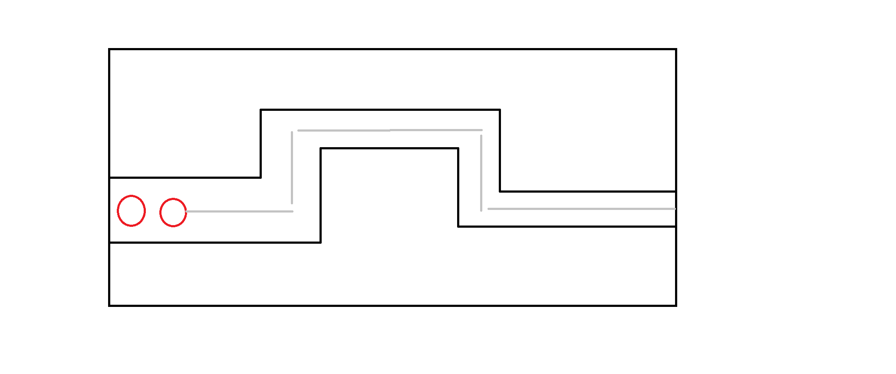
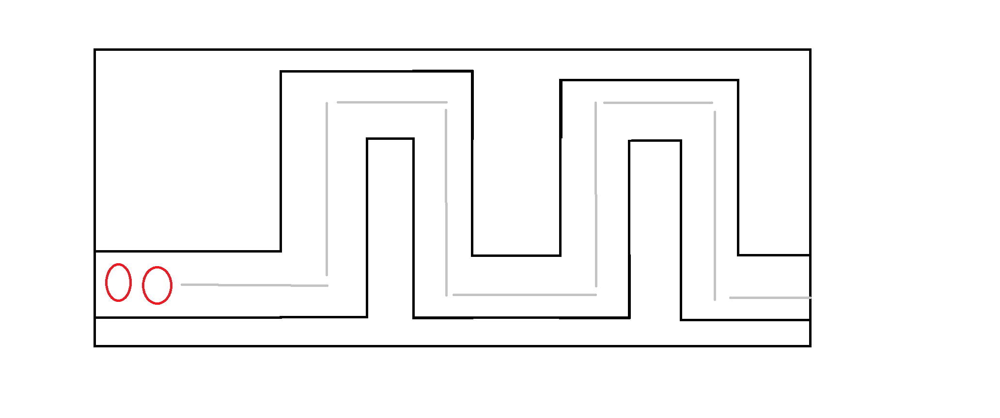

# Defenders of the Forest - Game Design Document

## Game Overview
Our game is a defense game where players must strategically place defenders on the map to stop attackers from advancing. The game is set in a fantasy world where different factions, including Fairies, Elves, Humans, Orcs, and Knights, exist. The forest, inhabited by Fairies, Elves, and Humans, is constantly under attack from Orcs and Knights who seek to destroy it. The player's main objective is to defend the forest by strategically placing defenders and using their resources wisely to fend off increasingly challenging waves of enemies. The game features two levels with different maps and enemy waves, and players can earn coins to unlock stronger defenders. The user interface includes a user manual, a coin counter, a wave counter, and a health bar to enhance the gameplay experience.

## Target Audience
The game is designed for players who enjoy strategy and tactical gameplay.

## Main Objectives
The main objective of the game is for the player to strategically place defenders on the map to stop attackers from advancing. The player must use their resources wisely to place defenders to effectively defend against increasingly challenging waves of enemies.

## Gameplay Mechanics
- Player can select defenders by click and place them on the map.
- Enemies are set with waypoints on the map on which they will move automatically.

## Story and Setting
- The game is set in a fantasy world.
- This world consists of different factions: Fairies, Elves, Humans, Orcs, and Knights.
- Fairies, Elves and Humans live in harmony while Orcs and Knights wants to destroy the forest they live in.
- The forest is constantly being attacked by Orcs and Knights.
- Knights are the most powerful faction and they are the final boss of the game.
- The player must defend the forest from the invaders.

## Characters
- Defenders:
    - Fairies
        - Fairy : attack enemies with magic.
    - Elves
        - Elf Archer : attack enemies with arrows.
        - Elf Mage  :  attack enemies with magic.
    - Humans
        - Human Archer : attack enemies with arrows.

- We have 3 types of fairies, 2 types of elves and 1 type of human defenders with different amount of attack power and cost.
    - Fairies:
        - Fairy-1 : attack power 50, cost 50 coins.
        - Fairy-2 : attack power 100, cost 150 coins.
        - Fairy-3 : attack power 100, cost 150 coins.
    - Elves:
        - Elf Archer : attack power 50, cost 50 coins.
        - Elf Mage : attack power 75, cost 100 coins.
    - Humans:
        - Human Archer : attack power 50, cost 50 coins.

- Level 1:
    - Enemies: Orcs
        - Number of Enemies: increases with multiple of 3.
    - Defenders:
        - Elf Archer
        - Elf Mage
        - Fairy-3

- Level 2:
    - Enemies: Knights
    - Number of Enemies: increases with multiple of 4.
    - Defenders:
        - Fairy-1
        - Fairy-2
        - Human Archer

## Levels and Progression

### Level Structure
- The game consists of two levels, each with a different map layout and enemy waves. Players progress through the levels by successfully defending against waves of enemies.
    - Level 1: Summer Forest
        - Number of waves: 5
        - Enemies: Orcs
        - Number of Enemies: increases with multiple of 3.
    - Level 2: Winter Forest
        - Number of waves: 10
        - Enemies: Knights
        - Number of Enemies: increases with multiple of 4.

#### Level 1: Summer Forest
- The first level of the game is set in the Summer Forest, where the player must defend against waves of Orcs. The level consists of 5 waves, with the number of enemies increasing with a multiple of 3 for each wave. The player can use Elf Archer, Elf Mage, and Fairy-3 defenders to defend against the Orcs.

#### Level 2: Winter Forest
- The second level of the game is set in the Winter Forest, where the player must defend against waves of Knights. The level consists of 10 waves, with the number of enemies increasing with a multiple of 4 for each wave. The player can use Fairy-1, Fairy-2, and Human Archer defenders to defend against the Knights.

>Note : Both the maps would further include details like trees, rocks, etc. to make it more visually appealing and prevent player from adding defenders everywhere.

### Progression System
- As players defeat enemies, they earn coins as a reward. These coins can be used to unlock and upgrade stronger elves and fairies, providing the player with more powerful defenders to use in subsequent levels.

&nbsp;

### Unlockable Content
- The game features unlockable content in the form of stronger elves and fairies. Players can use their earned coins to unlock these defenders, allowing for more strategic options and increased chances of success in defending against enemy waves.

## User Interface
- The game features a home screen with options to start the game, choose the levels or view the user manual.
- The game features a user manual that displays on how to play the game, available defenders, and enemy information.
- The game also features a coin counter that displays the player's current coin balance.
- The game features a wave counter that displays the current wave number.
- The game features a health bar that displays the player's remaining health.

## End Game
- The game ends when the player successfully defends against all waves of enemies in both levels.
- Player can restart the game or exit the game.

