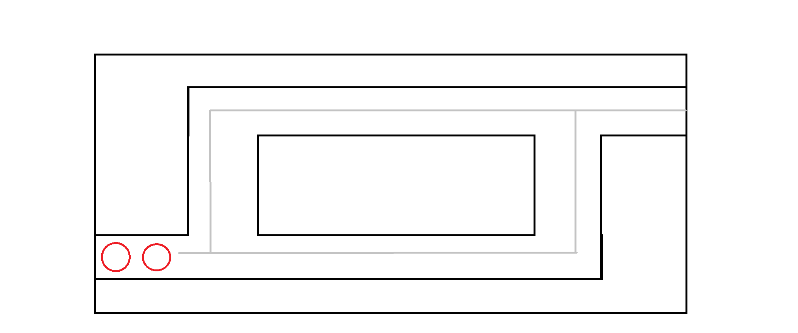
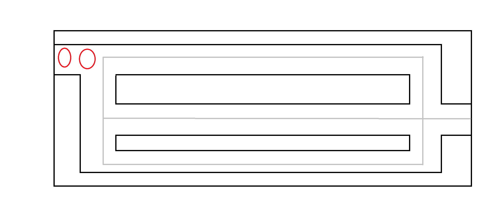

# Defenders of the Forest - Game Design Document(Version 2.0)

## Game Overview
Defenders of the Forest V2.0 is an upgraded version of the original game. The new version features additional levels, boss fights, an upgrade system as well as ability to remove defenders from the map. With new mechanics and features, Defenders of the Forest V2.0 aims to provide a more engaging and challenging gameplay experience for players.

The new version also includes player login and registration system to save the progress of the player. Player won't be able to begin a new level without completing the previous level.

## Main Objectives
The main objective of the game remains the same as the original version, which is to strategically place defenders on the map to stop attackers from advancing. However, the new version introduces additional objectives such as defeating boss enemies and upgrading defenders.

## New Gameplay Mechanics

The gameplay mechanics of Defenders of the Forest V2.0 have been enhanced with the following new features:

- **Player Login and Registration**: Players can now create an account and login to save their progress in the game.

- **Level Progression**: Players must complete each level in order to unlock the next level.

- **Boss Fights**: Players will encounter powerful boss enemies at the end of level-3 and level-4. Boss enemies have higher health than regular enemies, providing a greater challenge for players. 

- **Varying Range of Defenders**: Defenders now have varying attack ranges, with some defenders having a longer range than others. This adds a new layer of strategy to the game, as players must consider the range of their defenders when placing them on the map.

- **Upgrade System**: Players can now upgrade their defenders by spending coins to increase their attack power and range in level 3 and 4.
    - Upgrade-1: Increase attack power by 20, cost 25 coins.
    - Upgrade-2: Increase attack range by 10%, cost 50 coins.

- **Multi-Road Maps**: The new levels feature maps with multiple roads for enemies to travel on, providing a more challenging experience for players.

- **Remove Defenders**: Players can now remove defenders from the map by clicking on them in level 3 and 4.
    - Player will get 50% of the cost of the defender back when they remove a defender.

## New Characters
- Defenders : 
    - Fairies:
        - Elf Archer : 
            - attack power 50 
            - cost 50 coins.
            - range 250
        - Fairy-3 : 
            - attack power 80
            - cost 100 coins.
            - range 250
        - Elf Mage : 
            - attack power 75
            - cost 100 coins.
            - range 250
        - Fairy-2 : 
            - attack power 100
            - cost 150 coins.
            - range 225
        - Fairy-1 : 
            - attack power 150
            - cost 350 coins.
            - range 200
        
    - Humans:
        - Human Archer : 
            - attack power 50
            - cost 50 coins
            - range 250

- New Enemies:
    - **Trolls**: A new enemy type that appears in level-4. 
        - Troll-1: 
            - gives 10 coins on defeat.
            - health 200
            - speed 1.5
        - Troll-2: 
            - gives 20 coins on defeat.
            - health 250
            - speed 2
        - Troll-3: 
            - gives 25 coins on defeat.
            - health 400
            - speed 2

    - **Golem**: A new enemy type that appears as a boss enemy in level-3 and level-4. Golem has high health, making it a formidable opponent for players.
        - Golem-1: 
            - health 500
            - speed 1.5
        - Golem-2: 
            - health 750
            - speed 2

## Levels and Progression

### New Levels
Defenders of the Forest V2.0 features two new levels with different maps and enemy waves. The new levels are designed to provide a more challenging experience for players.

- Level-3: The Dark Forest
    - Map: A dark and mysterious forest with multiple roads for enemies to travel on.
    - Enemies: Orcs, Knights and Golem as boss enemy (new enemy type).
    - Number of Waves: 12
        - Number of Enemies: increases with multiple of 4.
    - Defenders : 
        - Fairy-1  
        - Elf Archer 
        - Elf Mage 
        - Fairy-2

    - Level-3 looks like this:

- Level-4: The Ashen Wasteland
    - Map: A barren wasteland with grey skies and multiple roads for enemies to travel on.
    - Enemies: Trolls(new enemy type) and Golem as boss enemy.
    - Number of Waves: 15
        - Number of Enemies: increases with multiple of 5.
    - Defenders : 
        - Fairy-1  
        - Elf Archer 
        - Elf Mage 
        - Fairy-2
    
    - Level-4 looks like this:

-  Player can earn coins by defeating enemies and use them to add other stronger defenders.
-  Initially player will have 350 coins to start with for both the levels.

>Note : Both the maps would further include details like trees, rocks, etc. to make it more visually appealing and prevent player from adding defenders everywhere.

> The maximum number of coins player can have is 950.

### Progression System
- As players defeat enemies, they earn coins as a reward. These coins can be used to unlock stronger elves and fairies or upgrade current defenders they have in place, providing the player with more powerful defenders to use.
- Player can move to next level only after successfully defending against all waves of enemies in the current level.
- Player won't be able to begin a new level without completing the previous level.

> Note: If Golem reaches the end of the path, player will lose the game.

## End Game

### Game Over : 
- Each enemy that reaches the end of the path will reduce the player's health by 1.
- The game ends when the player's health reaches 0.
- The player can restart the game or exit the game if this happens.
- If Golem reaches the end of the path, player will lose the game.

### Game Win :
- The game ends when the player successfully defends against all waves of enemies in both levels.
- Player can restart the game or exit the game when player completes all the levels.
