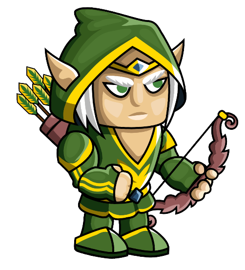
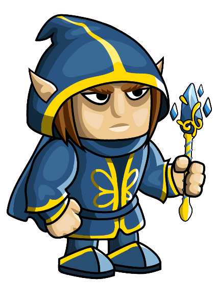
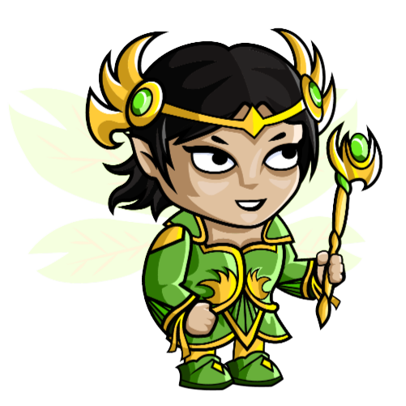
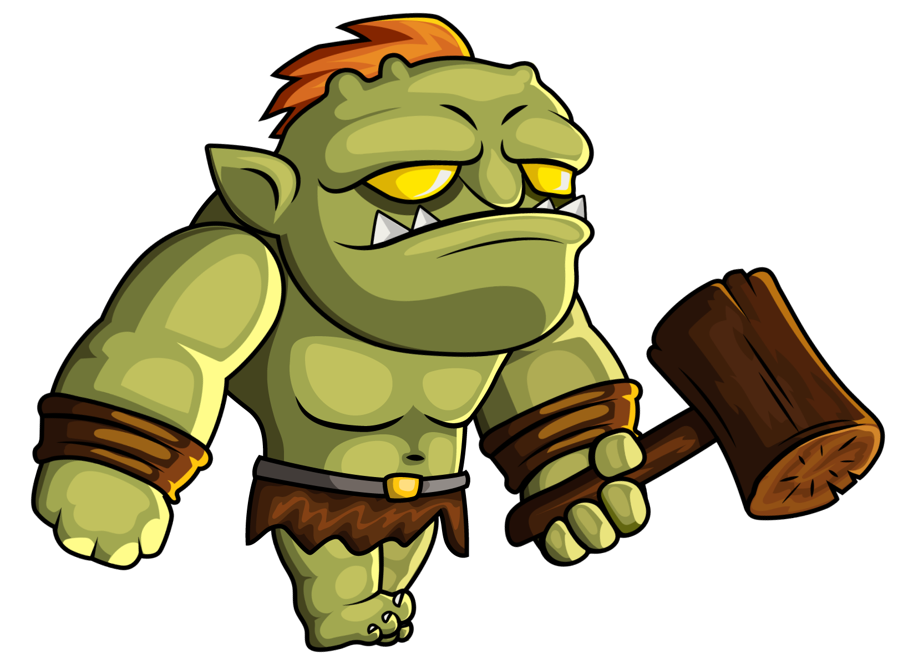
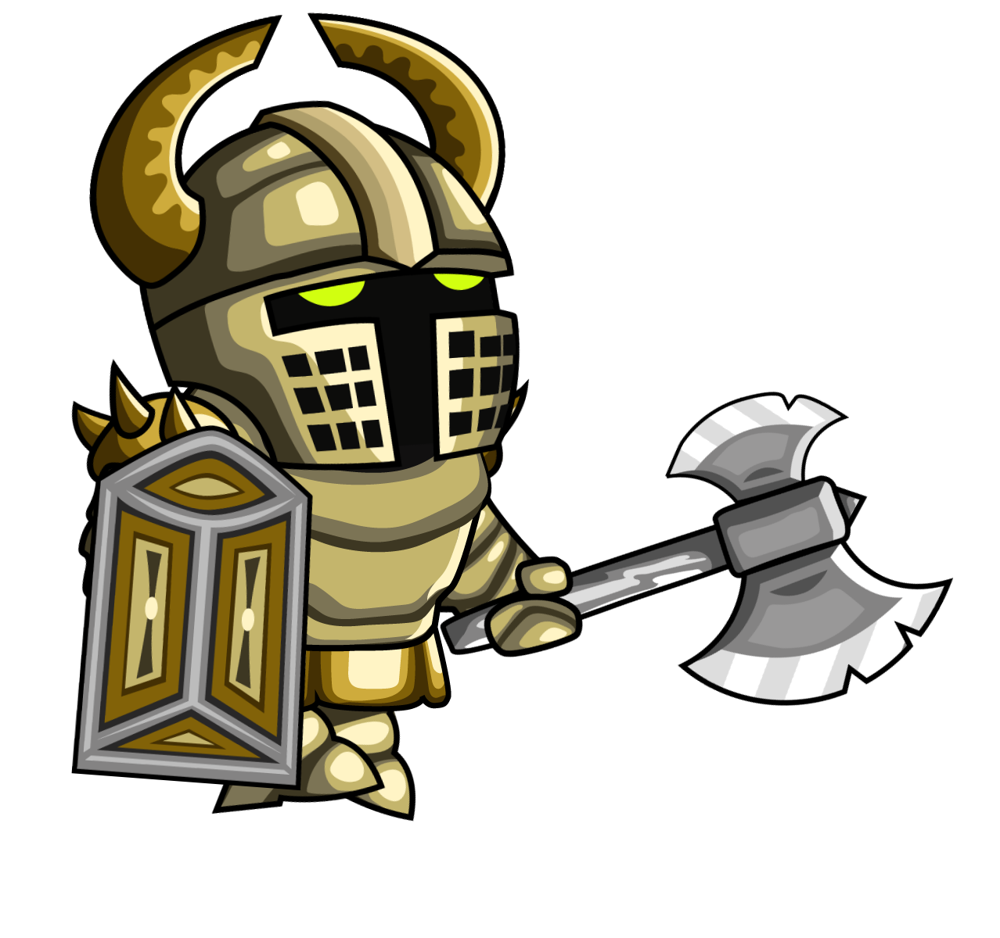

# User Manual for Defenders of the Forest

Welcome to the user manual for Defenders of the Forest. This document will guide you through the game mechanics, controls, and strategies to help you defend the forest against the enemies.

## **Table of Contents**

1. [Game Overview](#game-overview)
2. [How to Play](#how-to-play)
3. [Defenders](#defenders)
4. [Enemies](#enemies)
5. [Levels and Progression](#levels-and-progression)
6. [Gameplay Tips](#gameplay-tips)
7. [References](#references)

## **Game Overview**

Defenders of the Forest is a tower defense game where you must strategically place defenders to protect the forest from invading enemies. The game consists of two levels, each with multiple waves of enemies that increase in difficulty. Your goal is to defend the forest and prevent the enemies from reaching your base.

## **How to Play**

To play Defenders of the Forest, follow these steps:

1. Select a level to play.
2. Select defenders from the available options.
3. Defenders will automatically attack enemies within their range.
4. Place defenders on the map to defend against enemies.
5. Earn coins by defeating enemies and use them to add more defenders.
6. Enemies will move along the path towards your base. Defeat them before they reach the end.
7. Progress through the waves of enemies and complete the level to move to the next one.

## **Defenders**

Defenders are characters that you can place on the map to defend against enemies. Each defender has different attack stats that can help you in your defense. Here are the defenders available in the game:

| Defenders                                                                  | Attack Power | Cost |
| -------------------------------------------------------------------------- | ------------ | ---- |
|          | 50           | 50   |
|          | 75           | 100  |
|      | 100          | 150  |
|  | 50           | 50   |
|      | 80           | 100  |
|      | 100          | 350  |

## **Enemies**

Enemies are creatures that will try to invade the forest and reach your base. Each enemy has different health points and speed. You must strategically place defenders to defeat them before they reach the end of the path. Here are the enemies you will encounter in the game:

| Enemies                                                                | Health Points | Speed |
| ---------------------------------------------------------------------- | ------------- | ----- |
|        | 100           | 10    |
|        | 150           | 20    |
|        | 200           | 30    |
|  | 100           | 10    |
|  | 150           | 15    |
|  | 350           | 20    |

## **Levels and Progression**

Defenders of the Forest consists of two levels, each with multiple waves of enemies. To progress through the game, you must complete each level by defeating all waves of enemies. Here is an overview of the levels and progression system:

### **Level 1**

- There are 5 waves of enemies in level 1.
- Defeat all enemies in level 1 to progress to level 2.
- Enemies will increase in difficulty with each wave.
- Earn coins by defeating enemies and use them to add more defenders.
- Level 1 looks like this:

  -

- Level 1 has the following defenders available:

  | Defenders                                                              | Images | 
  | ---------------------------------------------------------------------- | ------------ | 
  |Elf Archer |      |          
  |Elf Mage |      | 
  |Fairy 1|  | 

- Attackers in level 1 are:
  | Enemies | Images |
  |---------|---------------|
  |Orc-1| | 
  |Orc-2| |  
  |Orc-3| |  

### **Level 2**

- There are 10 waves of enemies in level 2.
- Defeat all enemies in level 2 to complete the game.
- Enemies will be more challenging but less rewarding in this level.
- Use your strategic skills to defend against all waves of enemies.
- Level 2 looks like this:

  -

- Level 2 has the following defenders available:

  |Defenders| Image                                                                  |
  |----------| -------------------------------------------------------------------------- |
  |Human Warrior|  |
  |Fairy 2|      |
  |Fairy 3|      |

  

- Attackers in level 2 are:

    |Enemies| Image                                                            |
    |---|----------------------------------------------------------------------|
    |Knight-1|  |
    |Knight-2|  |
    |Knight-3|  |

## **Gameplay Tips**

- Place defenders strategically to cover the entire path and maximize their effectiveness.
- Manage your coins wisely and invest in defenders that complement each other.

  

## **References**

- [Pixel 16 Woods - Free Top Down Pixel Art Asset Pack](https://zedpixel.itch.io/pixel-16-woods-free-top-down-pixelart-asset-pack)
- [Free 2D Knight Sprite Sheets](https://free-game-assets.itch.io/free-2d-knight-sprite-sheets?download)
- [Free Tag Bullet Game Assets](https://itch.io/game-assets/free/tag-bullet)
- [2D Fantasy Elf Free Sprite Sheets](https://craftpix.net/freebies/2d-fantasy-elf-free-sprite-sheets/?num=1&count=70&sq=archer&pos=6)
- [2D Fantasy Woman Warrior Free Sprite Sheets](https://craftpix.net/freebies/2d-fantasy-woman-warrior-free-sprite-sheets/)
- [2D Fantasy Fairy Free Character Sprite](https://craftpix.net/freebies/2d-fantasy-fairy-free-character-sprite/)